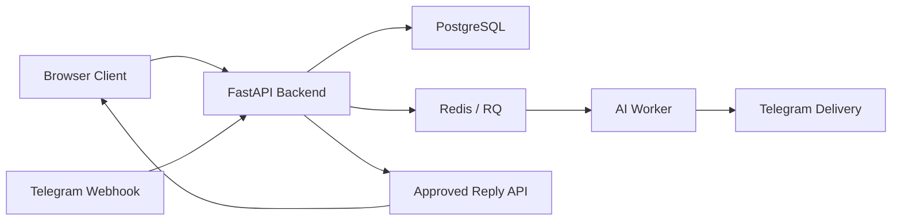

# Architecture

## Executive Summary

The system is a modular FastAPI backend with PostgreSQL as the source of truth, Redis/RQ for background transport, an isolated AI provider layer, and Telegram as a moderation edge. Browser and Telegram clients stay outside the trust boundary for workflow state.

## MVP vs Target

| area | mvp risk | target decision | why |
|---|---|---|---|
| Review ingestion | duplicate reviews can create duplicate work | persist `review_key` and return existing ids | protects idempotency and multi-account correctness |
| AI generation | provider-specific logic leaks into business code | isolate providers behind one contract | easier provider switching and safer retries |
| Moderation | Telegram can become implicit state store | keep moderation outcome only in PostgreSQL | restart-safe and auditable |
| Queueing | in-process polling can drift from production | use Redis-backed worker transport with DB lifecycle state | resilient async processing without losing durable state |
| Publishing | browser may act as source of truth | publish only after backend `approved` state | prevents accidental or stale publication |
| Operations | startup races and hidden failures | health checks, migrations, separate worker | deterministic deployability |

## Recommended Shape

## Component Responsibilities

- `api/`: thin HTTP layer, validation, response contracts
- `services/review_service.py`: dedupe, review/job creation, publish confirmation
- `services/ai_service.py`: prompt assembly, provider selection, output validation
- `services/queue_service.py`: Redis/RQ enqueue transport
- `services/telegram_service.py`: moderation formatting, callback handling, idempotency
- `providers/`: Ollama/OpenAI/YandexGPT/GigaChat adapters
- `workers/`: AI job execution, Telegram delivery, RQ worker bootstrap
- `repositories/`: durable reads/writes only

## Data Flow

1. Browser posts review to `POST /api/reviews`.
2. Backend deduplicates and creates durable `review` + `moderation_job`.
3. Backend enqueues `job_id` to the AI queue.
4. AI worker loads DB state, renders prompt, generates reply, stores `generated_reply`, transitions to `pending_review`, then enqueues Telegram delivery.
5. Telegram sends moderation actions back to `/api/telegram/webhook`.
6. Backend persists Telegram event, applies one valid moderation transition, and exposes approved reply to the browser.
7. Browser confirms publication through `POST /api/reviews/{review_id}/published`.

## Status Flow

- `new -> generating`
- `generating -> pending_review`
- `pending_review -> approved`
- `pending_review -> generating` on rewrite
- `pending_review -> ignored`
- `approved -> published`
- `* -> failed` on hard failure

## Technical Decisions

- Keep a modular monolith instead of splitting services: lower operational cost and clear local reasoning.
- Keep lifecycle state in PostgreSQL instead of Redis: restart safety and auditability.
- Use Redis/RQ only as transport: queue payloads stay id-based and small.
- Keep prompt text in files and provider specifics in adapters: easier operational editing and cleaner tests.
- Prefer safe no-op moderation behavior over forcing stale Telegram callbacks through invalid transitions.

## Phase Map

1. Backend foundation: durable reviews/jobs, dedupe, API.
2. AI layer: provider boundary, prompt pipeline, queued generation.
3. Telegram moderation: durable events, approve/rewrite/ignore/edit handling.
4. Publish flow: approved reply handoff and publication confirmation.
5. Hardening: logs, retries, Docker, tests, startup determinism.

## Risks And Next Steps

- Real provider integrations still need live credential verification in each environment.
- Telegram production rollout still needs a public HTTPS webhook endpoint and registration step.
- Queue stack currently uses RQ; if async orchestration grows materially, Arq may become the cleaner long-term choice.
